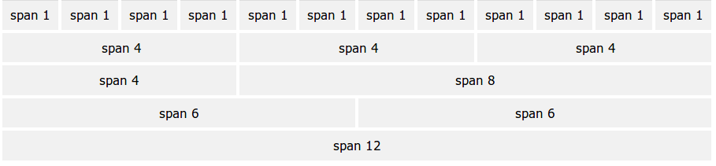
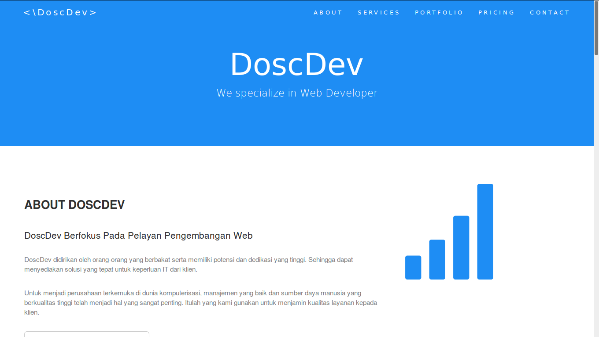

## Materi Pertemuan 2

### Bootsrap

#### Apa Itu Bootsrap ???

Bootstrap adalah suatu CSS framework interface (kerangka kerja tampilan) website yang sangat populer dikalangan web designer untuk memperindah tampilan website mereka. Kalo kalian tanya : Manfaatnya apa sih ? Jawaban singkatnya : Bootstrap memiliki teknologi ultra responsive yang membuat tampilan website lebih ringan ketika diload, otomatis menyesuaikan tampilan website ketika dibuka menggunakan device berbeda (PC,Laptop,maupun Smartphone) sehingga tampilan website akan optimal dimata pengunjung website/visitor. Dengan alasan tersebut,maka tidak sedikit web designer yang menggunakan framework ini. Nah, mungkin penjelasan diatas sudah bisa menerangkan pengertian dari Bootstrap itu sendiri.

Kalian Bisa Download file Bootsrap di https://getbootstrap.com/docs/3.3/getting-started/
atau bisa download di https://drive.google.com/open?id=11lSTG8rFqX9HKiSQ8flKRFQO4fqtesCf 

#### Bootstrap Grids

Bootstrap grid system memungkinkan hingga 12 kolom di halaman. 




#### Grid Classes
  - xs (untuk ponsel)
  - sm (untuk tablet)
  - md (untuk desktop)
  - lg (untuk desktop yang lebih besar) 

 Kelas-kelas di atas dapat dikombinasikan untuk membuat layout yang lebih dinamis dan fleksibel. 

####  Struktur dasar dari Bootstrap Grid 


```html
 <div class="row">
  <div class="col-sm-4">.col-sm-4</div>
  <div class="col-sm-4">.col-sm-4</div>
  <div class="col-sm-4">.col-sm-4</div>
</div>
```

#### Tabel
```html
<div class="table-responsive">          
  <table class="table">
    <thead>
      <tr>
        <th>#</th>
        <th>Firstname</th>
        <th>Lastname</th>
        <th>Age</th>
        <th>City</th>
        <th>Country</th>
      </tr>
    </thead>
    <tbody>
      <tr>
        <td>1</td>
        <td>Anna</td>
        <td>Pitt</td>
        <td>35</td>
        <td>New York</td>
        <td>USA</td>
      </tr>
    </tbody>
  </table>
  </div>
```


#### Gambar


img-rounded
Membuat sudut tumpul pada gambar


```html
 
```

img-circle
Membuat gambar menjadi bulat

```html
 
 ```

img-thumbnail
Membuat Gambar thumbnail

```html
 
  ```
 
 Gambar responsif 
 ```html
  
  ```

#### Jumbotron

Jumbotron merupakan sebuah style yang telah tersedia di Bootstrap yang bisa kita gunakan untuk meletakkan content yang berukuran cukup besar misalnya seperti untuk membuat header web ataupun content-content gambar yang di rasa membutuhkan ukuran yang cukup besar bisa menggunakan bootstrap agar tampilannya lebih rapi.

```html
<div class="container">
  <div class="jumbotron">
    <h1>Bootstrap Tutorial</h1>      
    <p>Bootstrap is the most popular HTML, CSS, and JS framework for developing responsive, mobile-first projects on the web.</p>
  </div>
  <p>This is some text.</p>      
  <p>This is another text.</p>      
</div>
```

#### Alerts

Membuat Pesan Peringatan

 .alert kelas, diikuti oleh salah satu dari empat kelas yaitu .alert-success , .alert-info , .alert-warning atau .alert-danger

```html
<div class="alert alert-success">
  <strong>Success!</strong> Indicates a successful or positive action.
</div>

<div class="alert alert-info">
  <strong>Info!</strong> Indicates a neutral informative change or action.
</div>

<div class="alert alert-warning">
  <strong>Warning!</strong> Indicates a warning that might need attention.
</div>

<div class="alert alert-danger">
  <strong>Danger!</strong> Indicates a dangerous or potentially negative action.
</div>
```


#### Buttons

 Bootstrap memberikan tujuh gaya tombol: 

   - .btn-default
   - .btn-primary
   - .btn-success
   - .btn-info
   - .btn-warning
   - .btn-danger
   - .btn-link

```html
  <button type="button" class="btn btn-default">Default</button>
  <button type="button" class="btn btn-primary">Primary</button>
  <button type="button" class="btn btn-success">Success</button>
  <button type="button" class="btn btn-info">Info</button>
  <button type="button" class="btn btn-warning">Warning</button>
  <button type="button" class="btn btn-danger">Danger</button>
  <button type="button" class="btn btn-link">Link</button>  
```

 Button Groups

```html
 <div class="btn-group">
  <button type="button" class="btn btn-primary">Apple</button>
  <button type="button" class="btn btn-primary">Samsung</button>
  <button type="button" class="btn btn-primary">Sony</button>
</div>
```

#### Glyphicons

Bootstrap memberikan 260 glyphicons dari Glyphicons Halfling set.
Glyphicons dapat digunakan dalam teks, tombol, toolbar, navigasi, bentuk, dll 

```html
 <p>Envelope icon: <span class="glyphicon glyphicon-envelope"></span></p>
<p>Envelope icon as a link:
  <a href="#"><span class="glyphicon glyphicon-envelope"></span></a>
</p>
<p>Search icon: <span class="glyphicon glyphicon-search"></span></p>
<p>Search icon on a button:
  <button type="button" class="btn btn-default">
    <span class="glyphicon glyphicon-search"></span> Search
  </button>
</p>
<p>Search icon on a styled button:
  <button type="button" class="btn btn-info">
    <span class="glyphicon glyphicon-search"></span> Search
  </button>
</p>
<p>Print icon: <span class="glyphicon glyphicon-print"></span></p>
<p>Print icon on a styled link button:
  <a href="#" class="btn btn-success btn-lg">
    <span class="glyphicon glyphicon-print"></span> Print
  </a>
</p> 
```
Link referensi icon:
https://getbootstrap.com/docs/3.3/components/

#### Badges
 
 Lencana adalah indikator numerik dari berapa banyak item yang terkait dengan link: 

```html
  <button type="button" class="btn btn-primary">Artikel <span class="badge">7</span></button>
  <button type="button" class="btn btn-success">Comments <span class="badge">3</span></button>    
  <button type="button" class="btn btn-danger">Cerita <span class="badge">5</span></button>      
```

#### Pagination

Jika kamu memiliki situs web dengan banyak halaman, kamu mungkin bisa menambahkan beberapa jenis pagination untuk setiap halaman.

```html
  <ul class="pagination">
    <li><a href="#">1</a></li>
    <li><a href="#">2</a></li>
    <li><a href="#">3</a></li>
    <li><a href="#">4</a></li>
    <li><a href="#">5</a></li>
  </ul>
```

#### Navigation Bar
 Sebuah bar navigasi adalah header navigasi yang ditempatkan di bagian atas halaman (Menu) 

```html

<nav class="navbar navbar-inverse">
  <div class="container-fluid">
    <div class="navbar-header">
      <button type="button" class="navbar-toggle" data-toggle="collapse" data-target="#myNavbar">
        <span class="icon-bar"></span>
        <span class="icon-bar"></span>
        <span class="icon-bar"></span>                        
      </button>
      <a class="navbar-brand" href="#">WebSiteName</a>
    </div>
    <div class="collapse navbar-collapse" id="myNavbar">
      <ul class="nav navbar-nav">
        <li class="active"><a href="#">Home</a></li>
        <li class="dropdown">
          <a class="dropdown-toggle" data-toggle="dropdown" href="#">Page 1 <span class="caret"></span></a>
          <ul class="dropdown-menu">
            <li><a href="#">Page 1-1</a></li>
            <li><a href="#">Page 1-2</a></li>
            <li><a href="#">Page 1-3</a></li>
          </ul>
        </li>
        <li><a href="#">Page 2</a></li>
        <li><a href="#">Page 3</a></li>
      </ul>
      <ul class="nav navbar-nav navbar-right">
        <li><a href="#"><span class="glyphicon glyphicon-user"></span> Sign Up</a></li>
        <li><a href="#"><span class="glyphicon glyphicon-log-in"></span> Login</a></li>
      </ul>
    </div>
  </div>
</nav>
```

navbar fixed top
membuat menu agar selalu tetap berada di atas meskipun kita scroll kebawah


```html
<nav class="navbar navbar-inverse navbar-fixed-top">
  <div class="container-fluid">
    <div class="navbar-header">
      <a class="navbar-brand" href="#">WebSiteName</a>
    </div>
    <ul class="nav navbar-nav">
      <li class="active"><a href="#">Home</a></li>
      <li><a href="#">Page 1</a></li>
      <li><a href="#">Page 2</a></li>
      <li><a href="#">Page 3</a></li>
    </ul>
  </div>
</nav>
  ```


#### Form

```html
 <div class="form-group">
	
      <label for="email">Email address</label>
      <input type="email" class="form-control" id="email" placeholder="Enter email" required="required">
    </div>
    

    <div class="form-group">
      <label for="pwd">Nama</label>
      <input type="text" class="form-control" id="pwd" placeholder="Nama Kamu" required="required">
    </div>
	

	<div class="form-group">
      <label for="comment">Comment:</label>
      <textarea class="form-control" rows="5" id="comment"></textarea>
    </div>
	
    <div class="form-check">
      <label class="form-check-label">
       <input class="form-check-input" type="checkbox">Berlangganan Newsletter 
      </label>
    </div>
	
  <br>
    <button type="submit" class="btn btn-primary">Kirim</button>
  ```


#### Carousel

Membuat slide gambar / tulisan
```html
  <div id="myCarousel" class="carousel slide" data-ride="carousel">
    <!-- Indicators -->
    <ol class="carousel-indicators">
      <li data-target="#myCarousel" data-slide-to="0" class="active"></li>
      <li data-target="#myCarousel" data-slide-to="1"></li>
      <li data-target="#myCarousel" data-slide-to="2"></li>
    </ol>

    <!-- Wrapper for slides -->
    <div class="carousel-inner">
      <div class="item active">
        
      </div>

      <div class="item">
        
      </div>
    
      <div class="item">
        
      </div>
    </div>

    <!-- Left and right controls -->
    <a class="left carousel-control" href="#myCarousel" data-slide="prev">
      <span class="glyphicon glyphicon-chevron-left"></span>
      <span class="sr-only">Previous</span>
    </a>
    <a class="right carousel-control" href="#myCarousel" data-slide="next">
      <span class="glyphicon glyphicon-chevron-right"></span>
      <span class="sr-only">Next</span>
    </a>
  </div>

```

#### Scrool Spy

Membuat posisi aktif pada menu saat mouse di scroll kebawah

```html
 <!-- The scrollable area -->
<body data-spy="scroll" data-target=".navbar" data-offset="50">

<!-- The navbar - The <a> elements are used to jump to a section in the scrollable area -->
<nav class="navbar navbar-inverse navbar-fixed-top">
...
  <ul class="nav navbar-nav">
    <li><a href="#section1">Section 1</a></li>
    ...
</nav>

<!-- Section 1 -->
<div id="section1">
  <h1>Section 1</h1>
  <p>Try to scroll this page and look at the navigation bar while scrolling!</p>
</div>
...

</body> 
```

### Membuat Web Sederhana Dengan Bootsrap




- Tambahkan Bootstrap CDN atau bisa menggunakan file yg sudah di download tadi 
- kemudian kita akan membuat navbar fixed top

```html
<body id="myPage" data-spy="scroll" data-target=".navbar" data-offset="60">
<nav class="navbar navbar-default navbar-fixed-top">
  <div class="container">
    <div class="navbar-header">
      <button type="button" class="navbar-toggle" data-toggle="collapse" data-target="#myNavbar">
        <span class="icon-bar"></span>
        <span class="icon-bar"></span>
        <span class="icon-bar"></span>                        
      </button>
      <a class="navbar-brand" href="#myPage"><\DoscDev></a>
    </div>
 
    <div id="myNavbar">
      <ul class="nav navbar-nav navbar-right">
        <li><a href="#about">ABOUT</a></li>
        <li><a href="#services">SERVICES</a></li>
        <li><a href="#portfolio">PORTFOLIO</a></li>
        <li><a href="#pricing">PRICING</a></li>
        <li><a href="#contact">CONTACT</a></li>
      </ul>
    </div>
  </div>
</nav>
 

 </body>
```

 - Membuat Jumbotron

```html
 <div class="jumbotron text-center">
  <h1>DoscDev</h1> 
  <p>We specialize in Web Developer</p> 
</div>
```

- Membuat Container ( About Section )

```html
<div id="about" class="container-fluid">
  <div class="row">
    <div class="col-sm-8">
      <h2>About DoscDev</h2><br>
<h4>DoscDev Berfokus Pada Pelayan Pengembangan Web</h4><br>
<p>DoscDev didirikan oleh orang-orang yang berbakat serta memiliki potensi dan dedikasi yang tinggi. Sehingga dapat menyediakan solusi yang tepat untuk keperluan IT dari klien.</p><br>
<p>Untuk menjadi perusahaan terkemuka di dunia komputerisasi, manajemen yang baik dan sumber daya manusia yang berkualitas tinggi telah menjadi hal yang sangat penting. Itulah yang kami gunakan untuk menjamin kualitas layanan kepada klien.</p>
<br>
      <button class="btn btn-default btn-lg">Download Profil Perusahaan</button>
    </div>
    
    
    <div class="col-sm-4">
      <span class="glyphicon glyphicon-signal logo"></span>
    </div>
  </div>
</div>

<div class="container-fluid bg-grey">
  <div class="row">
    <div class="col-sm-4">
      <span class="glyphicon glyphicon-globe logo slideanim"></span>
    </div>
    <div class="col-sm-8">
      <h2>Visi & Misi</h2><br>

      <h4><strong>Visi</strong> Menjadi perusahaan teknologi informasi dan komunikasi kelas dunia.</h4>
      <h4><strong>Misi</strong> Memberikan solusi keseluruhan teknologi informasi dan komunikasi untuk klien.</h4><br>

    </div>
  </div>
</div>

```
- Membuat Container ( Service Section )

```html
<div id="services" class="container-fluid text-center">
  <h2>SERVICES</h2>

  <h4><b>Apa yang kami buat ?</b></h4>
  <br>
  <div class="row slideanim">
    <div class="col-sm-4">
      <span class="glyphicon glyphicon-off logo-small"></span>
      <h4>Front End</h4>
      <p>Lorem ipsum dolor sit amet..</p>
    </div>
    <div class="col-sm-4">
      <span class="glyphicon glyphicon-heart logo-small"></span>
      <h4>Back End</h4>
      <p>Lorem ipsum dolor sit amet..</p>
    </div>
    <div class="col-sm-4">
      <span class="glyphicon glyphicon-lock logo-small"></span>
      <h4>Front End & Back End</h4>
      <p>Lorem ipsum dolor sit amet..</p>
    </div>
  </div>
<br><br><br>
  <h4><b>Prinsip Kami</b></h4><br>
  <div class="row slideanim">
    <div class="col-sm-4">
      <span class="glyphicon glyphicon-leaf logo-small"></span>
      <h4>Kepuasan Pelangan</h4>
      <p>Lorem ipsum dolor sit amet..</p>
    </div>
    <div class="col-sm-4">
      <span class="glyphicon glyphicon-certificate logo-small"></span>
      <h4>Produk & Layanan yang berkualitas</h4>
      <p>Lorem ipsum dolor sit amet..</p>
    </div>
    <div class="col-sm-4">
      <span class="glyphicon glyphicon-wrench logo-small"></span>
      <h4 style="color:#303030;">Menyediakan solusi terbaik untuk klien dalam Teknologi Informasi</h4>
      <p>Lorem ipsum dolor sit amet..</p>
    </div>
  </div>
</div>
```

- Membuat Container (Portofolio Section)

```html


<div id="portfolio" class="container-fluid text-center bg-grey">
  <h2>Portfolio</h2> 
  <h4>Produk Yang Kita Buat</h4><br>
  <div class="row text-center slideanim">
    <div class="col-sm-4">
      <div class="thumbnail">
        
        <p><strong>Facebook</strong></p>
        <p>2018</p>
      </div>
    </div>
    <div class="col-sm-4">
      <div class="thumbnail">
        
        <p><strong>Facebook</strong></p>
        <p>2018</p>
      </div>
    </div>
    <div class="col-sm-4">
      <div class="thumbnail">
        
        <p><strong>Facebook</strong></p>
        <p>2018</p>
      </div>
    </div>
  </div><br>

```

- Membuat Testimoni dengan Carousel

```html


  <h2>Testimoni</h2>
  <div id="myCarousel" class="carousel slide text-center" data-ride="carousel">
    <!-- Indicators -->
    <ol class="carousel-indicators">
      <li data-target="#myCarousel" data-slide-to="0" class="active"></li>
      <li data-target="#myCarousel" data-slide-to="1"></li>
   
    </ol>

    <!-- Wrapper for slides -->
    <div class="carousel-inner" role="listbox">
      <div class="item active">
        <h4>"This company is the best. I am so happy with the result!"<br><span>Rizki</span></h4>
      </div>
      <div class="item">
        <h4>"WOW!!"<br><span>Mark Zuckerberg</span></h4>
      </div>
     
    </div>

    <!-- Left and right controls -->
    <a class="left carousel-control" href="#myCarousel" role="button" data-slide="prev">
      <span class="glyphicon glyphicon-chevron-left" aria-hidden="true"></span>
      <span class="sr-only">Previous</span>
    </a>
    <a class="right carousel-control" href="#myCarousel" role="button" data-slide="next">
      <span class="glyphicon glyphicon-chevron-right" aria-hidden="true"></span>
      <span class="sr-only">Next</span>
    </a>
  </div>
</div>

```

- Membuat Container (Price Section)


```html


<div id="pricing" class="container-fluid">
  <div class="text-center">
    <h2>Harga</h2>
    <h4>Harga yang kami tawarkan</h4>
  </div><br>

  <div class="row slideanim">
    <div class="col-sm-4 col-xs-12">
      <div class="panel panel-default text-center">
        <div class="panel-heading">
          <h1>Front End</h1>
        </div>
        <div class="panel-footer">
          <h3>Rp.200.000</h3>
          <button class="btn btn-lg">Pesan</button>
        </div>
      </div>      
    </div>     


    
    <div class="col-sm-4 col-xs-12">
      <div class="panel panel-default text-center">
        <div class="panel-heading">
          <h1>Back End</h1>
        </div>
         <div class="panel-footer">
          <h3>Rp.400.000</h3>
          <button class="btn btn-lg">Pesan</button>
        </div>
      </div>      
    </div>       

    <div class="col-sm-4 col-xs-12">
      <div class="panel panel-default text-center">
        <div class="panel-heading">
          <h1>Front & Back End</h1>
        </div>
        <div class="panel-footer">
          <h3>Rp.800.000</h3>
          <button class="btn btn-lg">Pesan</button>
        </div>
      </div>      
    </div>    
  </div>
</div>

```

- Membuat Maps Google Dengan Fitur Google Maps Api

```html
<div style="height:400px;width:100%;">

    <iframe src="https://www.google.com/maps/embed?pb=!1m18!1m12!1m3!1d1980.1155905376913!2d110.40782157629837!3d-6.982023487884449!2m3!1f0!2f0!3f0!3m2!1i1024!2i768!4f13.1!3m3!1m2!1s0x2e708b4ec52229d7%3A0xc791d6abc9236c7!2sUniversitas+Dian+Nuswantoro!5e0!3m2!1sid!2sid!4v1522050531204" width="1234px" height="400px" frameborder="0" style="border:0" allowfullscreen></iframe>
  
  </div>
```

- Membuat Container (Contact Section)

```html
<div id="contact" class="container-fluid bg-grey">
  <h2 class="text-center">CONTACT</h2>
  <br>  
  <div class="row">
    <div class="col-sm-5">
        <p>Anda bisa menghubungi kami di :</p>
      <p><span class="glyphicon glyphicon-map-marker"></span> Universitas Dian Nuswatoro</p>
      <p><span class="glyphicon glyphicon-phone"></span> 081218181282</p>
      <p><span class="glyphicon glyphicon-envelope"></span> admin@doscdev.com</p>
    </div>
    <div class="col-sm-7 slideanim">
      <div class="row">
        <div class="col-sm-6 form-group">
          <input class="form-control" id="name" name="name" placeholder="Name" type="text" required>
        </div>
        <div class="col-sm-6 form-group">
          <input class="form-control" id="email" name="email" placeholder="Email" type="email" required>
        </div>
      </div>
      <textarea class="form-control" id="comments" name="comments" placeholder="Comment" rows="5"></textarea><br>
      <div class="row">
        <div class="col-sm-12 form-group">
          <button class="btn btn-default pull-right" type="submit">Send</button>
        </div>
      </div>
    </div>
  </div>
</div>
```

- Membuat Footer

```html
<footer class="container-fluid text-center">
  <a href="#myPage" title="To Top">
    <span class="glyphicon glyphicon-chevron-up"></span>
  </a>
  <p>DoscDev Theme Made By <a href="https://doscom.org" title="">Doscom</a></p>
</footer>
```


